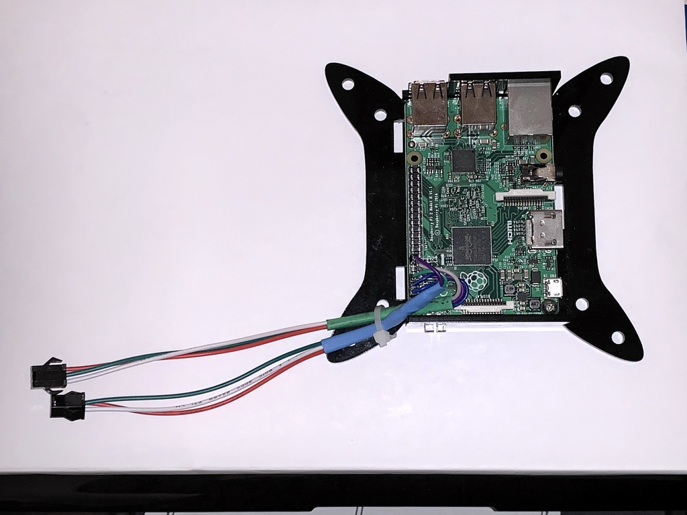
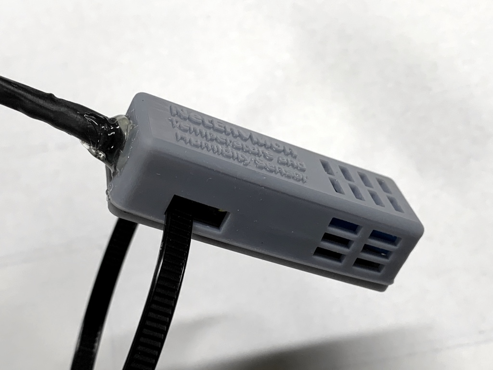
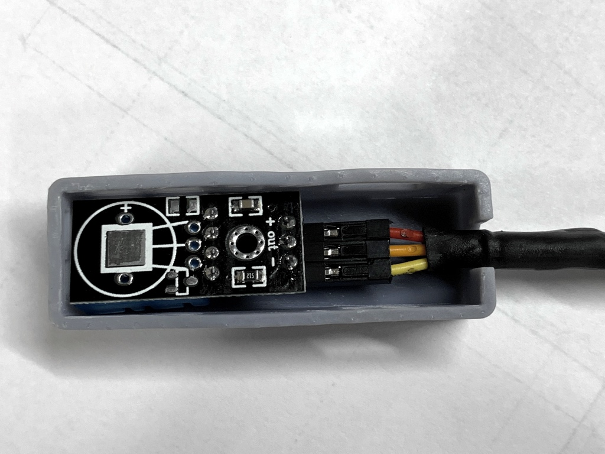
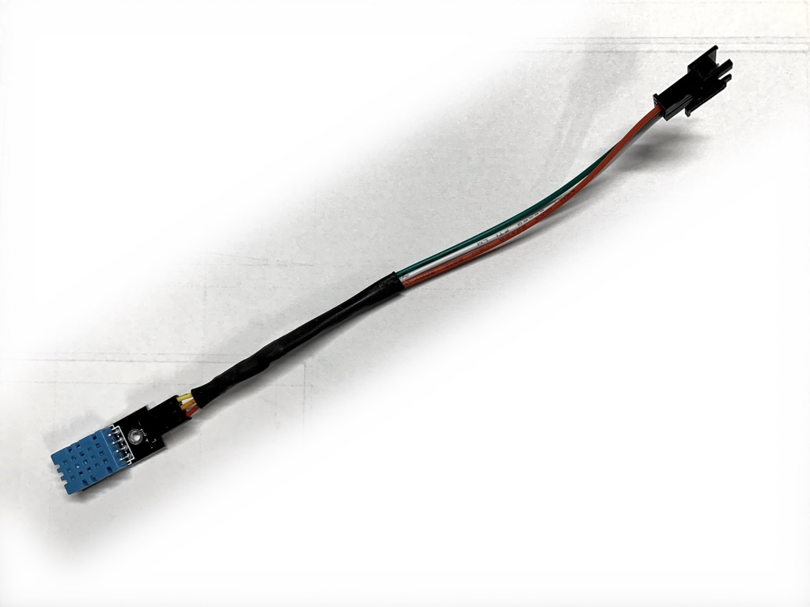

# README #

This project creates a low cost ( < $100) network enabled environmental monitoring device for monitoring the temperature and humidity of our server room. The goals of this project are more inline with an industrial monitoring system and not something like a home automation environment. This is why a ethernet enabled Raspberry Pi was used and not an existing ESP32 based solution.

It's based on projects such as this one:

https://tutorials-raspberrypi.com/raspberry-pi-measure-humidity-temperature-dht11-dht22/

or from Adafruit:

https://learn.adafruit.com/dht-humidity-sensing-on-raspberry-pi-with-gdocs-logging/python-setup

The details in this repo will be pretty light because there is so much easily located info already on-line. There is not much original here other than the very minimal Python HTTP server script and the enclosure to protect the sensors.

## Usage

A simple query to the IP address will cause it to query all configured sensors and return the values in a JSON chunk.

```
% curl 192.168.1.175
{"sensor_0": {"temperature": 27.0, "humidity": 47.0}, "sensor_1": {"temperature": 27.0, "humidity": 47.0}}
```

## Hardware

* Raspberry Pi (any version should work, verified with model 2B and newer)
* Raspberry Pi case (Consider your mounting location and method)
* DHT-11 Temperature and humidity Sensor (a single Pi can support multiple sensors)

Optional:

* 3 pin connectors (Recommended: JST SM 3 pin connector)
* JST SM 3 meter extension cables
* 3D printed sensor enclosure(s)
* POE splitter for Raspberry Pi

## 3D Printable case

The following 3D printable enclosure files are included in this repo:

* bottom.stl
* top.stl (Original top with extruded text)
* top_plain.stl (no extruded text, should print better on filament based printers)

## Assembly

The DHT sensors have three wires, a positive, negative, and data. The positive and ground can power the sensor directly from the Pi.

If you choose a sensor on a breakout board, you can also connect the data line directly to the Pi. Bare sensors will require a 10K pull-up resistor. See other tutorials for more detail on that.

The 3D printed enclosure has vent holes to allow the air to circulate, a circular opening for wiring, and a rectangular pass through for zip ties. These can ben used to mount the sensor and also ensure the case remains closed.

## Operating System

The OS is Raspbian Light which can be found here:

https://www.raspberrypi.org/downloads/raspbian/

The changes to the base OS were kept minimal:

* apt-get update and install python-dev
* Adafruit Library installed (see their tutorial linked above for details)

## Software

The Python script "netenvmon.py" is the only script needed to serve the data via web interface. It should be configured to start at boot. An additional simplified demo script, "dht_sample.py", is also included.

## To Do

I had intended on including a ready to run pi image in this repo. However, because it was made from an 8GB memory card, it was 8GB. This is much bigger than needed and should be trimmed down. This could be done by using a smaller card to capture the image, the unix truncate command, or possibly the pishrink.py script found on GitHub. If there is sufficient interest, I may pursue these options. However, it's probably best to use the latest Pi image and Adafruit drivers.

# Sample Images

The following sample images are included for reference:

Raspberry Pi wired for two sensors:


Sensor enclosure with heat shrink wrap and hot glue for strain relief, and zip ties for mounting:


Placement of sensor within enclosure:


Sensor wiring with JST SM 3 pin connector:

